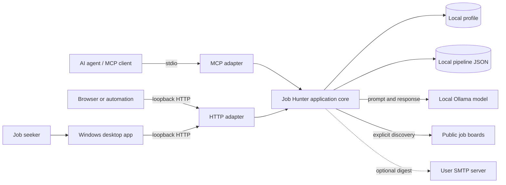
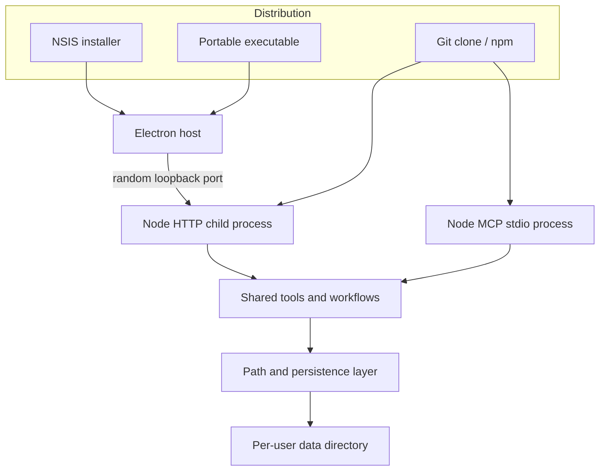
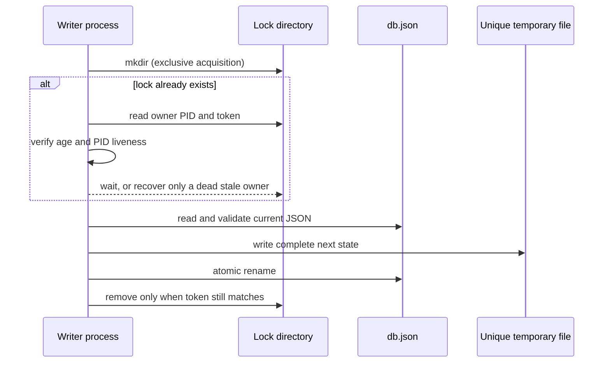

# Architecture case study

Open Job Hunter is both a usable product and a reference implementation of a local-first, agent-accessible application. This document records not only what was built, but why the boundaries exist and how the release was validated.

## Product intent

The product serves two entry points without duplicating business logic:

- people who want a Windows application that opens normally;
- developers and AI agents that need an MCP stdio process or an HTTP automation surface.

The principal constraint is privacy: candidate profiles, evaluations and application history remain on the user's machine. External traffic is limited to sources the user invokes, the locally configured LLM endpoint and optional SMTP delivery.

## Quality attributes

| Attribute | Architectural response | Evidence |
| --- | --- | --- |
| Portability | Paths derive from the installed module and user-data directory, never from the caller's working directory. | Runtime suite launches from `C:\WINDOWS`. |
| Privacy | Loopback HTTP binding by default, local Ollama and no wildcard CORS default. | Runtime assertions and environment defaults. |
| Data integrity | Cross-process lock ownership, PID liveness and atomic temporary-file replacement. | Concurrent writer, live-lock, dead-lock and cleanup tests. |
| Operability | Explicit `mcp`, `http` and `all` entry points plus health endpoint. | Build output and runtime suite. |
| Accessibility | Installer and portable Windows artifacts require neither Node.js nor a terminal. | Smoke tests execute both packaged artifacts. |
| Recoverability | Corrupt JSON is preserved and surfaced instead of silently overwritten. | Database and scheduler corruption tests. |

## System context

## Runtime containers

Electron is a distribution shell, not a second application. It reserves a free loopback port, starts the same compiled HTTP entry point, waits for `/health`, and then opens a sandboxed browser window. The MCP and HTTP adapters share the same schemas, evaluation flows and persistence functions.

## Persistence protocol

An old timestamp alone is insufficient to break a lock. A slow but live writer must remain protected. Recovery therefore requires both staleness and evidence that the owner process is no longer alive.

## Security and trust boundaries

- HTTP listens on `127.0.0.1` unless the operator explicitly overrides it.
- Cross-origin access is disabled unless `HTTP_ALLOWED_ORIGIN` is explicitly configured.
- The desktop renderer uses context isolation, disables Node integration and enables the Chromium sandbox.
- Navigation outside the local application is blocked; approved HTTP(S) links open in the operating-system browser.
- Profile and pipeline paths accept only absolute overrides, preventing behavior from changing with an agent client's `cwd`.
- Community Windows artifacts are currently unsigned. Published SHA-256 digests provide integrity verification, while commercial code signing remains roadmap work.

## Decision records

- [ADR-001: Local-first execution](./adr/001-local-first-execution.md)
- [ADR-002: Working-directory-independent paths](./adr/002-working-directory-independent-paths.md)
- [ADR-003: Safe JSON persistence across processes](./adr/003-safe-json-persistence.md)
- [ADR-004: One core, multiple runtime adapters](./adr/004-runtime-adapters-and-desktop-distribution.md)
- [ADR-005: AI-assisted delivery governance](./adr/005-ai-assisted-delivery-governance.md)
- [ADR-006: Verifiable release supply chain](./adr/006-verifiable-release-supply-chain.md)

## Verification strategy

The release gate combines several kinds of evidence:

1. TypeScript compilation and unit tests.
2. Multi-process persistence tests rather than only in-process promises.
3. Runtime execution from an adversarial working directory.
4. Assertions that MCP stdout remains protocol-clean and does not open HTTP unexpectedly.
5. Bind-conflict, corrupt-configuration and stale-lock recovery tests.
6. Windows smoke tests of both unpacked and portable distributions.
7. Dependency audit, staged-diff whitespace check and independent review evidence.

The governing principle is that an LLM opinion is not executable evidence. Review complements deterministic tests; it does not replace them.

Official releases additionally follow the repository's [Code signing policy](../../CODE_SIGNING_POLICY.md), [Privacy policy](../../PRIVACY.md) and [third-party component inventory](../../THIRD_PARTY_NOTICES.md).

## Delivery ownership

Product direction, release authorization and acceptance belong to the human owner. LLM agents contribute implementation, architectural challenge, test construction and review under explicit provider separation. This is deliberately described as **AI-assisted engineering with human accountability**: it demonstrates orchestration skill without misrepresenting authorship or delegating responsibility to a model.
